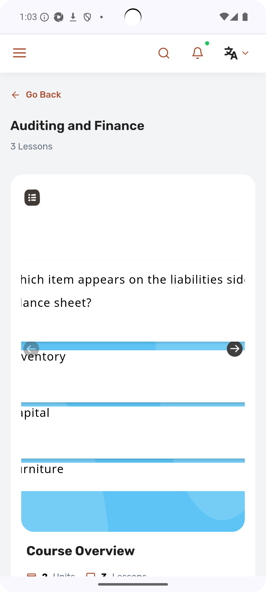
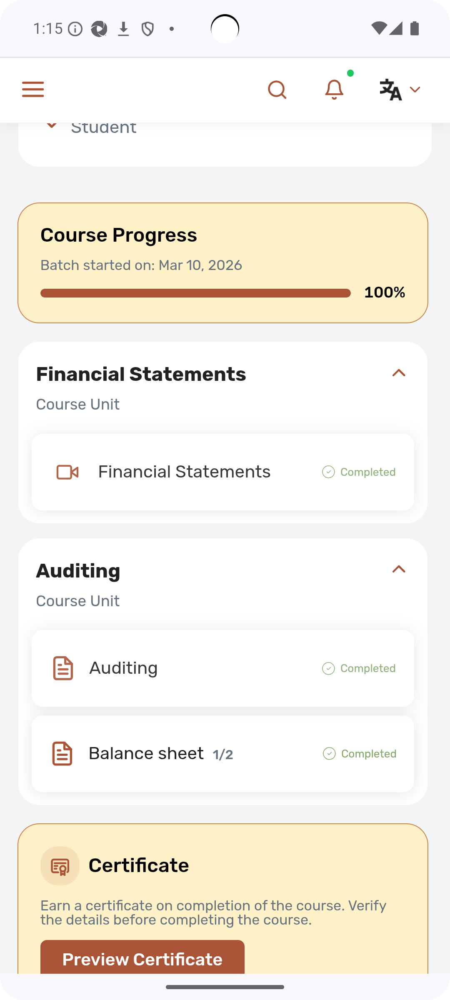
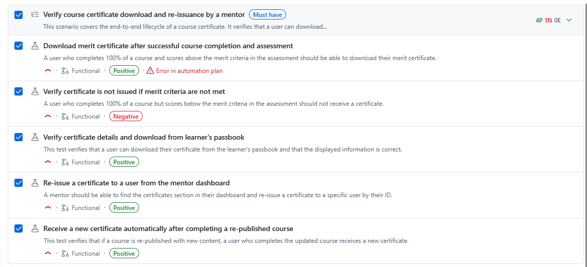
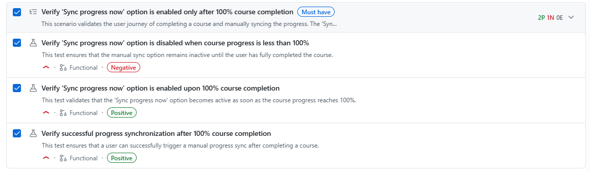
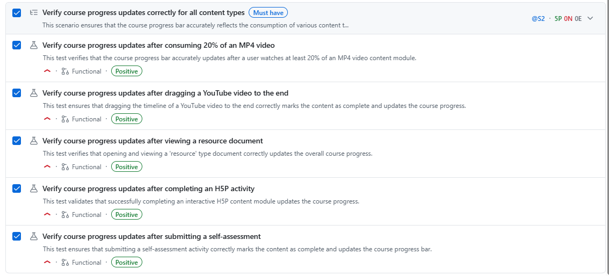
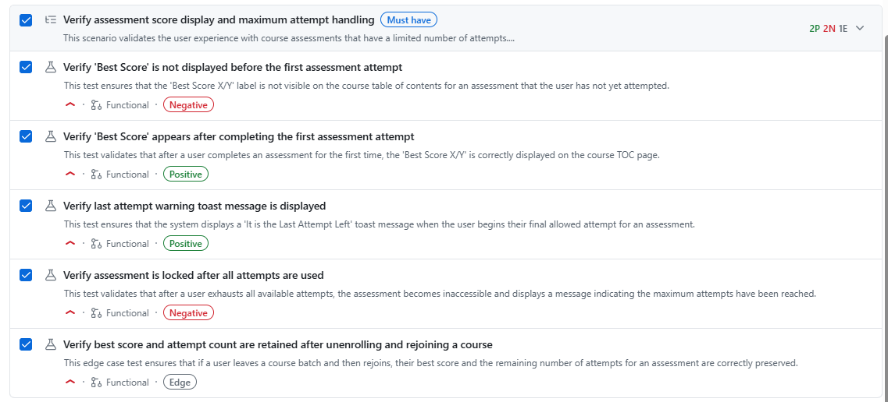
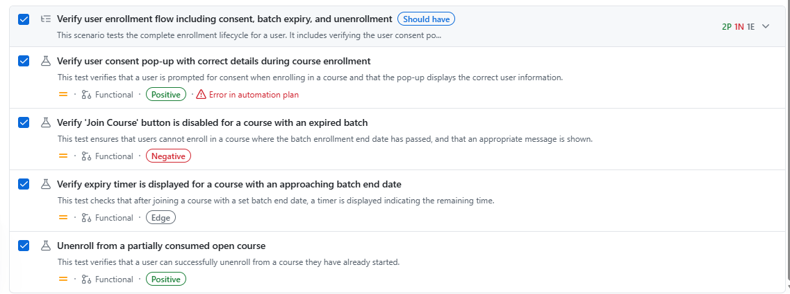

## Login Test

- Satisfied

## Course Consumption Test
Course: "Auditing and Finance" <br>
Test cases satisfied: `Tc_56`, `Tc_61`

### PASSED RESULTS
- The user is able to click on the ""Sync progress now"" and the progress is synced." 

- The user should be displayed with the kebab menu in the course progress section once course is consumed with 100%

- When the user clicks on the Kebab menu ""Sync progress now"" is deactivated/disabled till the user hits 100% completion. Once the user reaches 100%, activate this option. Till then its leave course

### BUGS

- Course assessment is not viewable


- Received Course 100% before completing the final **Balance sheet assessment under Auditing Unit**



| Step | Action                                      | Result                                                                 |
|------|---------------------------------------------|------------------------------------------------------------------------|
| 1    | Tapped magnifying icon (Search for content) | Search page opened                                                     |
| 2    | Searched "Auditing and Finance"             | Course found in results                                                |
| 3    | Opened the course                           | Course page loaded with content player                                 |
| 4    | Scrolled to find Course Units               | ✅ Found: Financial Statements (Completed), Auditing Course Unit (with Auditing + Balance sheet) |
| 5    | Completed course units                      | ✅ Financial Statements already completed; Auditing PDF scrolled through (marked Completed); Balance sheet quiz loaded |
| 6    | Verified Course Progress                    | 100% confirmed                                                         |
| 7    | Clicked 3-dots / Sync progress button       | ✅ "Sync progress now" menu appeared and was tapped successfully          |


## Course Progress Verification 
Course: "Course 10-03" <br>
Test cases satisfied: `Tc_57`

### PASSED RESULTS
- User should be able to enroll to the course and consume each content successfully.

- After conuming each content, course progress should be updated

### FAILED

- **NONE**

| Step | Action                                   | Result                                                                 |
|------|------------------------------------------|------------------------------------------------------------------------|
| 1    | Tap magnifying/search icon               | Search page opened successfully                                        |
| 2    | Search for "11th March Course"           | Course found — "3 Lessons, 2 Units"                                    |
| 3    | Open course & scroll to find units       | Course Unit 1: March2-PDF Content (Completed), epub data (Completed). Course Unit 2: 6thMarch-HTML-Content (In Progress) |
| 4    | Track current progression                | Course Progress = 67% (2/3 lessons completed)                          |
| 5    | Complete 6thMarch-HTML-Content (tap "CLOSE ME" button in HTML player) | Content marked as Completed                                            |
| 6    | Verify progression updated               | ✅ Course Progress updated to 100%, Sync progress now button available    |


## Certificate issueing

### PASSED RESULTS
- User should be able to enroll to the course and consume each content successfully.

- After conuming each content, course progress should be updated

### FAILED

- Hamburger Menu cant be opened in the course page, only accessible in the Explore section


### How to run

```cmd
npm run wdio:suite
```


---------------------
Certificates


Sync Progress


Progress updates for all course types


Assessment handling


Enrollment flow
